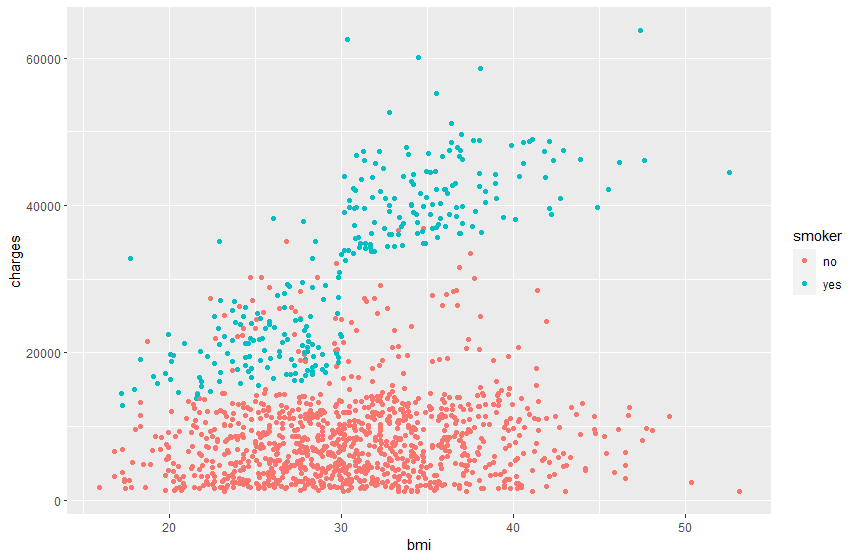
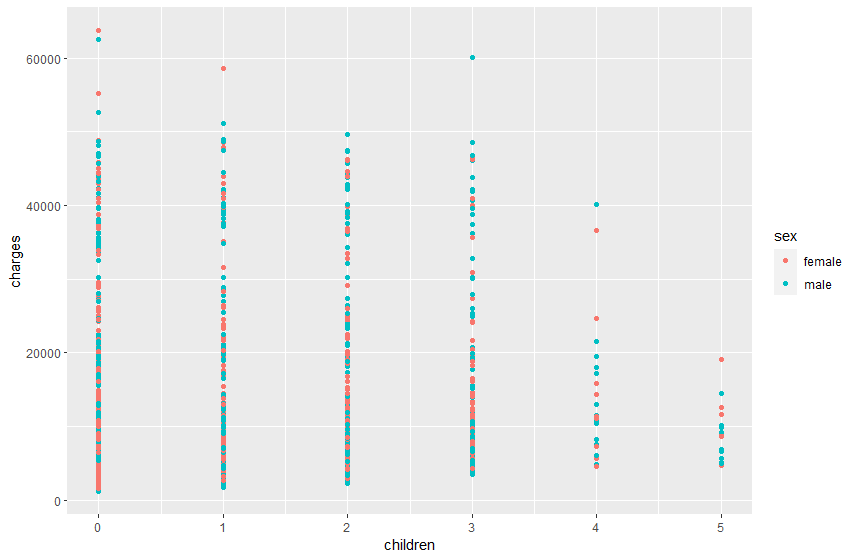
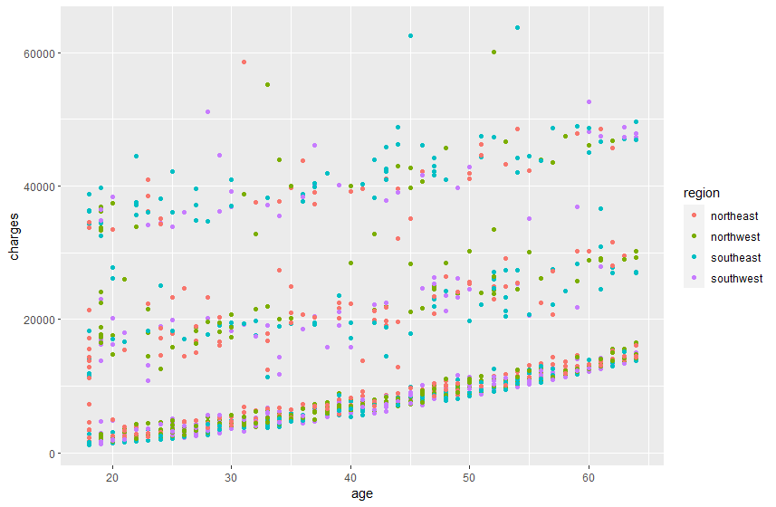
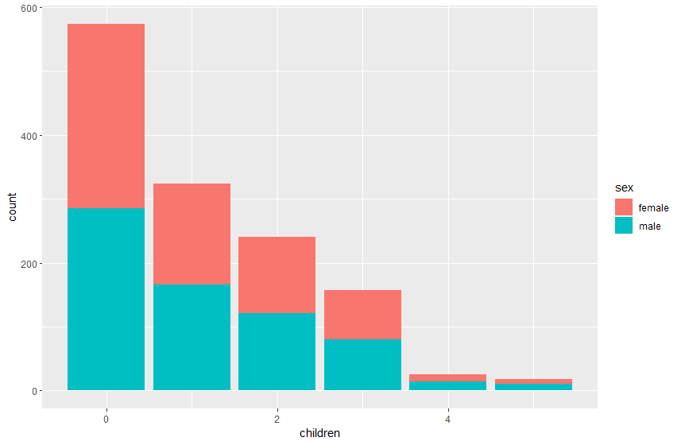
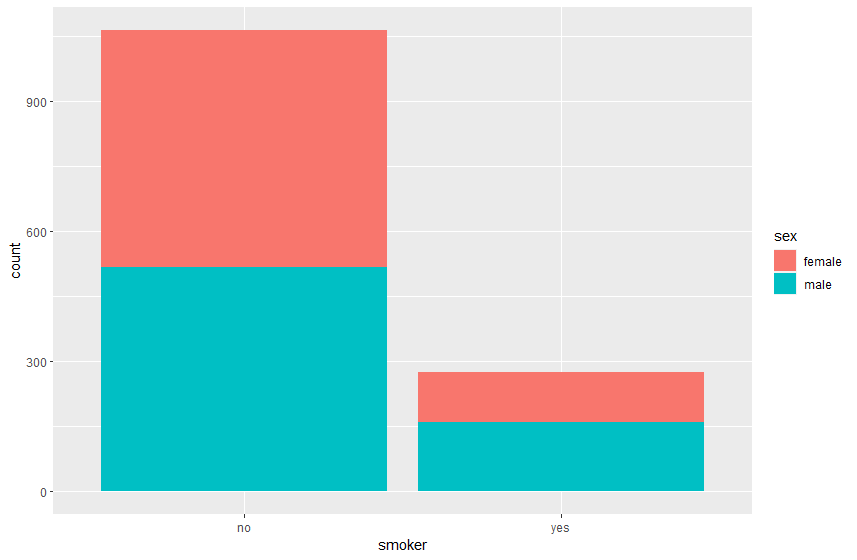
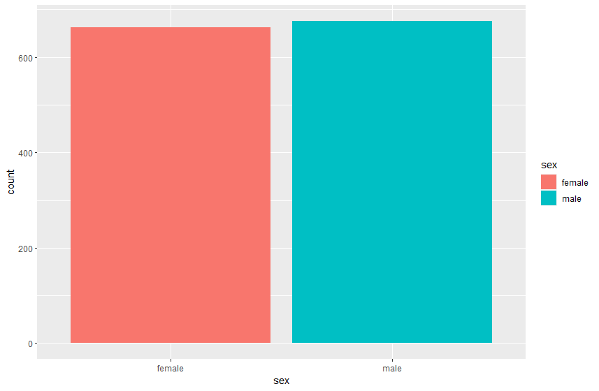
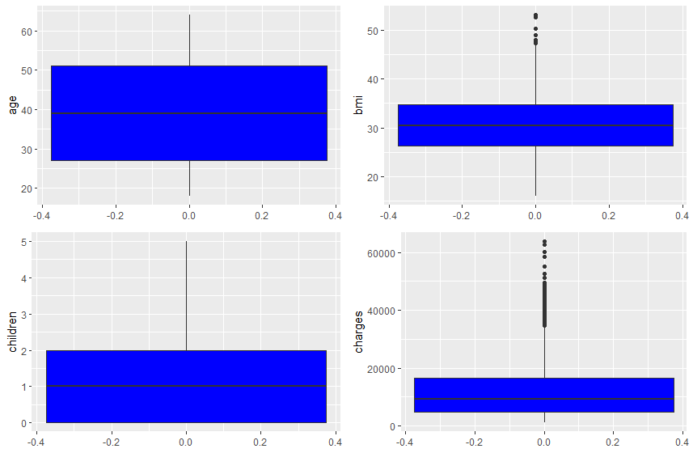
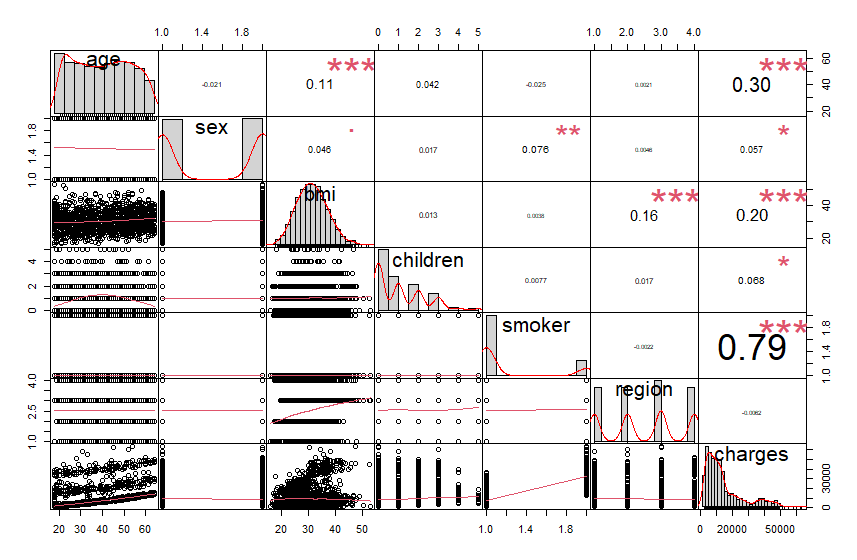

# Linear Regession on Medical Cost Personal Datasets

**⛳Deskripsi Masalah**

Machine Learning with R by Brett Lantz is a book that provides an introduction to machine learning using R. As far as I can tell, Packt Publishing does not make its datasets available online unless you buy the book and create a user account which can be a problem if you are checking the book out from the library or borrowing the book from a friend. All of these datasets are in the public domain but simply needed some cleaning up and recoding to match the format in the book.

**📌Tujuan Analisis**

Membantuk model regresi dari data yang tersedia

## Table of contents
- [Dataset dan Variabel](https://github.com/DiannitaOlipmimi/Regresi#dataset-dan-variabel)
- [Result](https://github.com/DiannitaOlipmimi/Regresi#result)
- [Links](https://github.com/DiannitaOlipmimi/Regresi#link)

## 🧵Dataset dan Variabel
**📒Data awal dataset personal medical cost**

| age | sex    | bmi    | children | smoker | region    | charges      |
|-----|--------|--------|----------|--------|-----------|--------------|
| 19  | female | 27.9   | 0        | yes    | southwest | 16884.924    |
| 18  | male   | 33.77  | 1        | no     | southeast | 1725.5523    |
| 28  | male   | 33     | 3        | no     | southeast | 4449.462     |
| 33  | male   | 22.705 | 0        | no     | northwest | 21984.47061  |
| 32  | male   | 28.88  | 0        | no     | northwest | 3866.8552    |

**📒Variabel dalam data**
- `age`: age of primary beneficiary
- `sex`: insurance contractor gender, female, male
- `bmi`: Body mass index, providing an understanding of body, weights that are relatively high or low relative to height, objective index of body weight (kg / m ^ 2) using the ratio of height to weight, ideally 18.5 to 24.9
- `children`: Number of children covered by health insurance / Number of dependents
- `smoker`: Smoking
- `region`: the beneficiary's residential area in the US, northeast, southeast, southwest, northwest.
- `charges`: Individual medical costs billed by health insurance

## 🧵**Result**

**📒Langkah Analisis:**

✅ *Exploratory Data Analysis* (EDA):
1. Melakukan pengecekan apakah terdapat missing data, duplicate data, dan error data

    ```R
    # pengecekan data
    > dim(data)
    [1] 1338    7

    > names(data)
    [1] "age"      "sex"      "bmi"      "children" "smoker"   "region"   "charges" 

    # missing value 
    > sum(is.na(data)) # total keseluruhan NA bila ada
    [1] 0

    > colSums(is.na(data)) # total NA per kolom
     age      sex      bmi children   smoker   region  charges 
       0        0        0        0        0        0        0  
    ```

    dari hasil yang didapatkan, diketahui dimensi data sebanyak 7 kolom dan 1338 baris. diketahui pula bahwa data personal medical cost tidak memiliki nilai NA atau nilai kosong. 

    ```R
    > tab1(data$children, sort.group = "decreasing", cum.percent = TRUE, graph = FALSE)
    data$children : 
            Frequency Percent Cum. percent
    0             574    42.9         42.9
    1             324    24.2         67.1
    2             240    17.9         85.1
    3             157    11.7         96.8
    4              25     1.9         98.7
    5              18     1.3        100.0
    Total      1338   100.0        100.0
    > tab1(data$region, sort.group = "decreasing", cum.percent = TRUE, graph = FALSE)
    data$region : 
            Frequency Percent Cum. percent
    southeast       364    27.2         27.2
    southwest       325    24.3         51.5
    northwest       325    24.3         75.8
    northeast       324    24.2        100.0
    Total        1338   100.0        100.0
    ```
    melihat one-way tabulation untuk mengetahui frekuensi dari variabel `children` dan `region`

3. Melakukan deskriptif statistik pada data (melihat rata-rata, median, dan nilai lainnya)

    ```R
    # Statistik Deskriptif 
    # install.packages("pastecs")
    > library(pastecs)
    > stat.desc(data)
                        age          sex          bmi     children       smoker       region      charges
    nbr.val      1.338000e+03 1.338000e+03 1.338000e+03 1.338000e+03 1.338000e+03 1.338000e+03 1.338000e+03
    nbr.null     0.000000e+00 0.000000e+00 0.000000e+00 5.740000e+02 0.000000e+00 0.000000e+00 0.000000e+00
    nbr.na       0.000000e+00 0.000000e+00 0.000000e+00 0.000000e+00 0.000000e+00 0.000000e+00 0.000000e+00
    min          1.800000e+01 1.000000e+00 1.596000e+01 0.000000e+00 1.000000e+00 1.000000e+00 1.121874e+03
    max          6.400000e+01 2.000000e+00 5.313000e+01 5.000000e+00 2.000000e+00 4.000000e+00 6.377043e+04
    range        4.600000e+01 1.000000e+00 3.717000e+01 5.000000e+00 1.000000e+00 3.000000e+00 6.264855e+04
    sum          5.245900e+04 2.014000e+03 4.102763e+04 1.465000e+03 1.612000e+03 3.366000e+03 1.775582e+07
    median       3.900000e+01 2.000000e+00 3.040000e+01 1.000000e+00 1.000000e+00 3.000000e+00 9.382033e+03
    mean         3.920703e+01 1.505232e+00 3.066340e+01 1.094918e+00 1.204783e+00 2.515695e+00 1.327042e+04
    SE.mean      3.841024e-01 1.367353e-02 1.667142e-01 3.295616e-02 1.103632e-02 3.020571e-02 3.310675e+02
    CI.mean.0.95 7.535090e-01 2.682390e-02 3.270500e-01 6.465140e-02 2.165039e-02 5.925574e-02 6.494682e+02
    var          1.974014e+02 2.501596e-01 3.718788e+01 1.453213e+00 1.629689e-01 1.220771e+00 1.466524e+08
    std.dev      1.404996e+01 5.001596e-01 6.098187e+00 1.205493e+00 4.036940e-01 1.104885e+00 1.211001e+04
    coef.var     3.583531e-01 3.322808e-01 1.988751e-01 1.100989e+00 3.350761e-01 4.391967e-01 9.125566e-01
    ```

    Hasil Deskriptif Statistik yang didapatkan dapat digunakan sebagai langkah awal identifikasi data, dimana terlihat data personal medical cost memiliki nilai `charges` paling tinggi pada nilai $63,770 sedangkan nilai paling rendah pada $1,122 dengan nilai standar deviasi sebesar  1.21.

4. Memvisualisasikan data untuk melihat pola data


    
    Scatter plot Charges VS BMI: data memiliki pola positif pada data-data dengan nilai `BMI` tinggi dan memiliki status YES pada variabel `smoker`. artinya apabila seseorang memiliki status perokok, semakin tinggi berat badan maka biaya atau `charges` yang harus dibayarkan semakin tinggi pula.



    Scatter plot Charges VS Children: data terbagi menjadi 5 kategori sesuai dengan banyaknya anak yang dimiliki. pada data ini tidak terdapat pola yang pasti sehingga biaya atau `charges` dari rumah sakit tidak bergantung pada jumlah anak.


    Scatter plot Charges VS Age: dari hasil yang terbentuk terlihat pola positif dimana semakin tua seseorang (`age`) maka semakin tinggi pula biaya atau `charges` yang harus dibayar. dalam plot ini juga terlihat bahwa region tidak mempengaruhi biaya.


    Bar plot Children: terlihat pada plot bahwa pasien yang datang memiliki 0 pada nilai `children` atau tidak memiliki anak, sedangkan jenis kelamin pasien pada masing-masing jumlah anak berbanding sama atau tidak ada perbedaan antara laki-laki dan perempuan


    Bar plot Smoker: terlihat lebih banyak pasien dengan status tidak merokok dibandingkan yang merokok.


    Bar plot Sex: jumlah pasien laki-laki dan perempuan hampir sama dengan jumlah pasien yang paling banyak adalah laki-laki.

5. Mengubah data kategorik menjadi ata numerik apabila diperlukan

    ```R
    > # Data Wrangling
    > # Encoding data
    > unique(data$sex)
    [1] "female" "male"  
    > unique(data$smoker)
    [1] "yes" "no" 
    > unique(data$region)
    [1] "southwest" "southeast" "northwest" "northeast"
    > 
    > data$sex = as.numeric(factor(data$sex))
    > data$smoker = as.numeric(factor(data$smoker))
    > data$region = as.numeric(factor(data$region))
    ```

    dikarenakan terdapat variabel yang memiliki tipe data kategorik eperti variabel `Sex`, `Smoker`, dan `Region`, maka silakukan data encoding untuk mengubah masing-masing nilai unik pada variabel menjai numberik

6. Melihat adanya outlier menggunakan boxplot



    dapat disimpulkan aanya nilai outlier atau nilai ekstrem paa variabel `BMI` dan `Charges`, untuk itu dilakukan perhitungan untuk menentukan batas bawah dan batas atas data dalam variabel dapat dikatakan ekstrem. salah satu caranya adalah dengan menggunakan teknik IQR atau Interquartile Range. teknik ini memiliki rumus,

    $$IQR = Q1 - Q3$$
    $$upper limit = Q3 + IQR * 1.5$$
    $$lower limit = Q1 - IQR * 1.5$$

7. Menghapus outlier

    ```R
    > # mencari limit outlier
    > upper_limit_bmi = quantile(data$bmi,0.75)+1.5*IQR(data$bmi)
    > upper_limit_bmi
    75% 
    47.29 
    > lower_limit_bmi = quantile(data$bmi,0.25)-1.5*IQR(data$bmi)
    > lower_limit_bmi
    25% 
    13.7 
    > 
    > # mencari letak outlier pada data
    > outlier=data[!(data$bmi > lower_limit_bmi & data$bmi < upper_limit_bmi ),]
    > outlier
        age sex   bmi children smoker region   charges
    117   58   2 49.06        0      1      3 11381.325
    287   46   1 48.07        2      1      1  9432.925
    402   47   2 47.52        1      1      3  8083.920
    544   54   1 47.41        0      2      3 63770.428
    848   23   2 50.38        1      1      3  2438.055
    861   37   1 47.60        2      2      4 46113.511
    1048  22   2 52.58        1      2      3 44501.398
    1089  52   2 47.74        1      1      3  9748.911
    1318  18   2 53.13        0      1      3  1163.463
    ```

8. Mencari hubungan antar variabel menggunakan matriks scatter plot




✅ Analisis:
1. Membuat model regresi linier berganda

    ```R
    > # linear regression
    > #analisis regresi berganda
    > regresi=lm(charges~age+sex+bmi+children+smoker+region,data = data)
    > summary(regresi)

    Call:
    lm(formula = charges ~ age + sex + bmi + children + smoker + 
        region, data = data)

    Residuals:
    Min     1Q Median     3Q    Max 
    -11343  -2807  -1017   1408  29752 

    Coefficients:
                Estimate Std. Error t value Pr(>|t|)    
    (Intercept) -35151.14    1174.41 -29.931  < 2e-16 ***
    age            257.29      11.89  21.647  < 2e-16 ***
    sex           -131.11     332.81  -0.394 0.693681    
    bmi            332.57      27.72  11.997  < 2e-16 ***
    children       479.37     137.64   3.483 0.000513 ***
    smoker       23820.43     411.84  57.839  < 2e-16 ***
    region        -353.64     151.93  -2.328 0.020077 *  
    ---
    Signif. codes:  0 ‘***’ 0.001 ‘**’ 0.01 ‘*’ 0.05 ‘.’ 0.1 ‘ ’ 1

    Residual standard error: 6060 on 1331 degrees of freedom
    Multiple R-squared:  0.7507,	Adjusted R-squared:  0.7496 
    F-statistic: 668.1 on 6 and 1331 DF,  p-value: < 2.2e-16
    ```

    dari hasil regresi linier, didapatkan moodel sebagai berikut

    ```math
    Charges = -35151.14 + (257.29*Age) + (-131.11*Sex) + (332.57*BMI) + 
    (479.37*Children) + (23820.43*Smoker) + (-353.64*region) + errors
    ```
    

## 🧵**Link**
📊**Kaggle dataset**
https://www.kaggle.com/datasets/mirichoi0218/insurance

📊**Kaggle Notebook**
https://www.kaggle.com/code/diannitaekaputri/regression-on-medical-cost